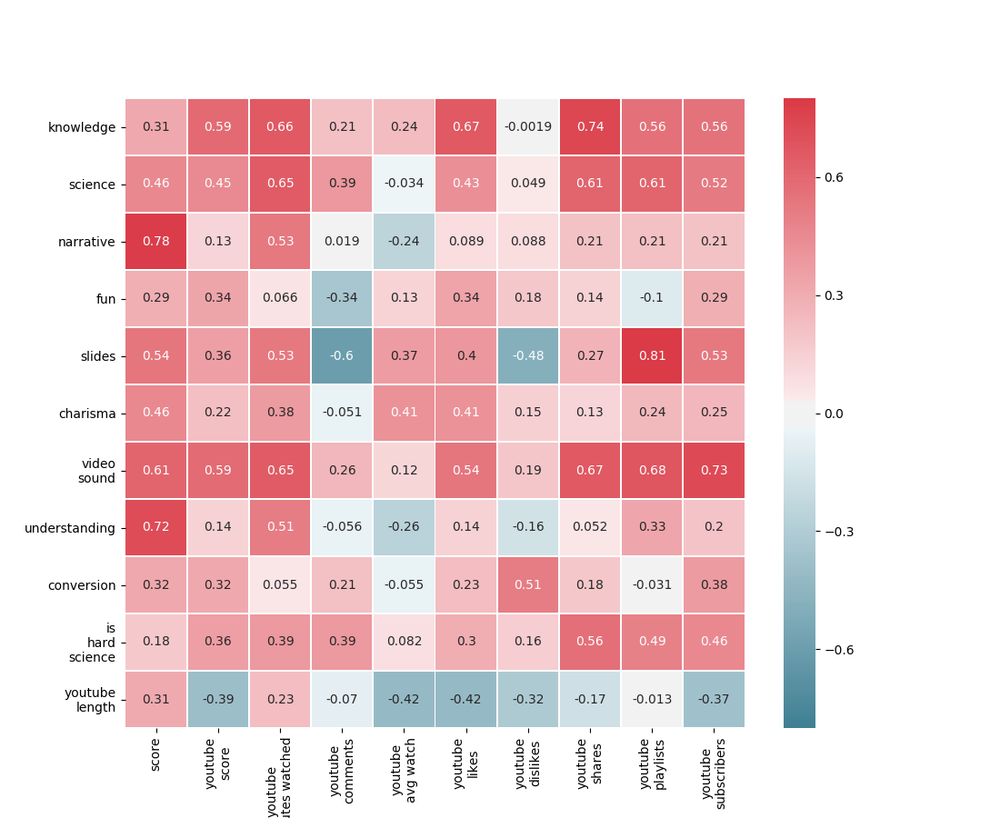

```{r setup, include=FALSE}
knitr::opts_chunk$set(echo = TRUE)

library(rpart)		
library(rattle)		
library(RColorBrewer)		

responses_norm <- read.csv("../data/responses-norm.csv")
responses_in <- responses_norm[responses_norm$in_15x4 == 1,]
responses_out <- responses_norm[responses_norm$in_15x4 == 0,]
concatenated <- read.csv("../data/concatenated.csv")
```

### Зачем?

Мы делаем выступления в 15х4. Мы снимаем их на видео и выкладываем на YouTube.

Зрители приходят в наш лекторий, на наш канал и на наш сайт.

Но на лекциях говорим мы, а зрители молчат.

Мы хотим *знать больше* о том, что именно привлекает зрителей.

Мы хотим *помочь лектору* сделать своё выступление более интересным.

Мы хотим понять, от чего зависит *успех или неуспех ролика на YouTube*.

### Как?

Мы - научно-популярный лекторий, и потому наш метод поиска ответа на этот вопрос - статистическое исследование.

Для проведения этого исследования мы отобрали 8 лекций и предложили участникам и зрителям проекта заполнить небольшой опросник о них.

**Спасибо всем, кто поучаствовал в опросе - без вас ничего этого бы не было.**

Таким образом, для исследования у нас были следующие данные:

- Ответы в опроснике. Респонденты оценивали выступление по таким параметрам:
    - Насколько им понравилась лекция в целом ("score")
    - Насколько познавательной была лекция ("knowledge")
    - Насколько научным был материал ("science")
    - Насколько целостным было повествование ("narrative")
    - Насколько весёлой / развлекательной была подача ("fun")
    - Насколько хороши были слайды презентации ("slides")
    - Насколько харизматичен лектор ("charisma")
    - Насколько хороши звук и видео в ролике ("video_sound")
    - Насколько лектор компетентен в своей теме ("understanding")
    - Является ли респондент соорганизатором 15х4 ("in_15x4")
- Статистика YouTube, а именно:
    - Интегральная оценка популярности видео ("youtube_score")
    - Суммарное время просмотра ("youtube_minutes_watched")
    - Количество комментариев ("youtube_comments")
    - Доля видео, которая в среднем просматривается за один раз ("youtube_avg_watch")
    - Количество лайков ("youtube_likes")
    - Количество дизлайков ("youtube_dislikes")
    - Количество расшариваний видео ("youtube_shares")
    - Количество плейлистов, в которые входит видео ("youtube_playlists")
    - Количество зрителей, которые подписались на канал после просмотра видео ("youtube_subscribers")
- Дополнительная информация:
    - Является ли предмет лекции естественно-научным ("is_hard_science")
    - Конверсия, то есть соотношение количества отзывов о лекции к количеству показов этой лекции с предложением пройти опрос ("conversion")

Исходные данные лежат в папке data/raw.

Предварительная обработка проведена с помощью скриптов cleanup.py, correlate.py и correlate-raw.py

### А есть ли у вас план, господа?

План такой:

1. Сначала мы [посмотрим на данные в целом](#результаты-опроса) и убедимся, что они осмысленные и отражают то, что мы хотим измерить.
2. Потом мы проведём [корреляционный анализ](#корреляционный-анализ). Главная его цель - найти мультиколлинеарности (разные способы измерения одного и того же) в данных и исключить их перед следующей стадией.
3. Центральная часть исследования - это [регрессионный анализ](#регрессионный-анализ). Мы узнаем, что именно делает лекцию популярной, а также мы уверены в том, что влияние есть.
4. Наконец, мы проведём дополнительный [анализ с помощью деревьев принятия решений](#анализ-с-помощью-деревьев-принятия-решений).
5. В конце мы посмотрим на собранные разными методами факты и [подведём итог](#выводы).

## Исследование

### Результаты опроса

Для начала проверим, как выглядят результаты опроса

```{r}
plot_param <- function(param_key, param_name) {
  barplot(table(factor(responses_norm[[param_key]], levels=1:5)), col="darkblue", main=param_name)
}

par(mfrow=c(3,3))
plot_param("score", "Общая оценка")
plot_param("knowledge", "Познавательность")
plot_param("science", "Научность")
plot_param("narrative", "Целостность")
plot_param("charisma", "Харизма")
plot_param("fun", "Веселье")
plot_param("video_sound", "Видео и звук")
plot_param("slides", "Слайды")
plot_param("understanding", "Компетентность")
```

Видим, что ответы на каждый из вопросов распределны нормально, с медианным значением 4, модой 4 или 5. Можно сделать вывод о том, что зрители, в целом, отвечали на вопросы добросовестно и что они доброжелательно относятся к предложенному контенту

Посмотрим также на средние оценки по каждому вопросу:

```{r}
data_tmp = t(rbind(
  colMeans(responses_norm[,3:11]),
  colMeans(responses_in[,3:11]),
  colMeans(responses_out[,3:11])
))
data_tmp = data_tmp[order(data_tmp[,1], decreasing = TRUE),]
colnames(data_tmp) <- c('все', 'участники', 'не участники')
data_tmp
```

Хотя разброс значений невелик, можно заметить, что зрители наиболее критично оценивают технические моменты (слайды, видео, звук) и наименее критично - эфемерные (понимание лектором своей темы, целостность повествования).

Участники и не-участники 15х4 различаются мало. В целом участники чуть более критичны ко всем аспектам оценивания.

### Корреляционный анализ

Прежде всего нужно определить, можно ли доверять данным опроса - возможно, из-за малого размера выборки они слишком искажены и не представляют никакой ценности.

Для этого измерим корелляцию "общей оценки" по резльутатам опроса с "общей оценкой" по данным YouTube.

```{r}
cor(concatenated$score, concatenated$youtube_score)
```

Это - довольно высокий коэффициент корреляции. Можно сделать вывод, что значения связаны друг с другом, но не являются двумя способами измерить одно и то же.

Результаты корреляционного анализа отдельных ответов:


В первую очередь на этом графике нас интересует мультиколлинеарность - её нужно исключить перед регрессионным анализом.

Мы видим две сильные мультиколлинеарности - между весёлостью лекции и харизмой лектора, а также между научностью и познавательностью.

При этом веселье и познавателньость имеют более высокие корреляции с целевой метрикой (оценкой), поэтому их мы оставим для регрессионного анализа, а харизму и научность исключим.

Кроме этого, можно отметить, что участие/неучастие респондента в 15х4 не коррелирует ни с одним параметром анкеты.

Сравним матрицу корреляций участников и не-участников 15х4:


Видим, что в целом разные аспекты отзывов участников сильно коррелируют друг с другом - гораздо сильнее, чем среди не-участников. Таким образом, участники оценивают, *насколько лекция понравилась им в целом*, а не-участники подходят к разным аспектом относительно *изолированно*. Исключение составляет оценка видео и звука - её даже участники 15х4 рассматривают отдельно.

Результаты корреляционного анализа средних оценок (обратите внимание, что это исследование построено всего на 8 точках, а потому имеет очень малую мощность):



Из этого (большого) списка попарных корреляций можно сделать следующие выводы:

- Последние три колонки по-разному измеряют **популярность ролика на YouTube**, имеет смысл оценивать их вместе. Видим, что как и для общей оценки **познавательность/научность** имеет большое значение для продвижения. А вот *веселье/харизма* - нет. Видимо, ролики 15х4 не настолько развлекательные, чтобы стать вирусными

- Кроме того, можно отметить исключительную важность *качественного видео и звука* для продвижения

- **Длительность лекции** имеет *негативные* корреляции со всеми остальными параметрами. Значит, выходить за пределы формата, чтобы рассказать ещё чуть больше - почти всегда **плохая** идея

- *Конверсия* имеет значительную корреляцию с *количеством дизлайков*. Видимо, зрители, которых "зацепило" интересное название и не понравилось содержание — это именно те, кто больше прочих готовы поставить дизлайк

- *Естественно-научность* (is hard science) имеет заметную корреляцию со всеми *метриками продижения*. Видимо, делиться биологией более стильно, чем делиться психологией

- Сильная негативная корреляция *количества комментариев* и средней оценки *слайдов* наводит на мысль, что комментируют в основном затем, чтобы поругать. На самом деле причина в том, что среди участвовавших видео одно (о ВИЧ-диссидентах) привлекло значительное недоброжелательное внимание соответствующего сообщества, и потому имеет много больше комментариев, чем все прочие. Это же видео имеет самую низкую оценку слайдов. Таким обрзаом, корреляция является артефактом вследствие малой мощности исследования

Интересно также сравнить средние оценки каждой лекции среди участников и не-участников 15х4:


Видим, что корреляции фактически нет. Похоже, участники проекта сильно оторваны от своей аудитории и оценивают буквально каждый аспект по-разному.

### Регрессионный анализ

Это - центральная часть исследования, главный вопрос.
На какие именно аспекты лекции обратить внимание, чтобы она понравилась пользователю?
(обратите внимание - из исследования исключены мультиколлинеарные факторы)

И вот он, ответ:
```{r}
data_tmp <- subset(responses_norm, select=-c(lecture, X, charisma, science))
summary(lm(score ~ ., data=data_tmp))
```

Ответ совершенно недвусмысленен - популярной лекцию делает в первую очередь познавательность и во вторую - живая подача.
Корреляции по обоим параметрам очень сильные, при этом у познавательности ещё и высокий весовой коэффициент.

Можно провести отдельное исследование участников и не-участников 15х4:
```{r}
summary(lm(score ~ ., data=data_tmp[data_tmp$in_15x4 == 1,]))
summary(lm(score ~ ., data=data_tmp[data_tmp$in_15x4 == 0,]))
```

Видим некоторую разницу - для участников живая подача не имеет особого значения, в то время как для не-участников она очень важна.

### Анализ с помощью деревьев принятия решений

Анализ с помощью деревьев принятия решений - хорошее средство понять структуру воздействия факторов, выявленных в регрессионном анализе.

Например, при регрессионном анализе выживаемости пассажиров "Титаника" размер семьи не имеет значительного влияния. В то же время при построении дерева становится видно, что для пассажира 1-го класса выживаемость значительно повышалась, если он был один - а для пассажиров 3-го, напротив, если у него были родственники.

```{r}
data_tmp <- subset(responses_norm, select=-c(lecture, X, charisma, science, narrative))
fancyRpartPlot(rpart(as.formula(score ~ .), data_tmp, method="anova", minsplit=18), sub="")  
```

Видим, что главным фактором по-прежнему является познавательность.
Если лекция познавательна, то хорошо бы ей быть ещё и весёлой - это разница между высокой и очень высокой оценкой.
Если лекция не познавательна, то хорошо бы лектору хотя бы владеть материалом - это разница между средней и низкой оценкой

Сравним деревья для участников и не-участников 15х4:
```{r}
fancyRpartPlot(rpart(as.formula(score ~ .),data_tmp[data_tmp$in_15x4 == 0,],method="anova",minsplit=13),sub="Не участники") 
fancyRpartPlot(rpart(as.formula(score ~ .),data_tmp[data_tmp$in_15x4 == 1,],method="anova",minsplit=7),sub="Участники") 
```

Видим, что важность понимания лектором своей темы привнесена в предыдущее дерево участниками проекта.

Познавательность очень важна для обеих категорий, но для участников она ещё важнее. Лекция, имеющая отличную оценку за "познавательность", но только хорошую за "веселье" и "видео", скорее всего получит у участника итоговую оценку 5, а у не-участника 4.

Среди участников высоким значением познавателньости считается только 5, среди не-участников — 4 и 5.

## Выводы

- Если вы хотите понравиться участнику 15х4 - впечатлите его новыми фактами. Понимайте свой предмет глубоко, в том числе за пределами лекции.
    - Когда вы слышите мнение участника проекта о выступлении, имейте в виду, что скорее всего участник оценил выступление в целом и перенёс долю этой оценки на каждый аспект.
    - Также имейте в виду, что оценки ваших коллег по лекторию почти никак не связаны с оценками зрителей.
- Если вы хотите понравиться посетителям лектория - можете чуть меньше внимания уделять познватательности, но обязательно обеспечьте интересную и живую подачу материала.
    - Если вы сделаете что-то не так, вас вряд ли забросают помидорами - зрители 15х4 в целом настроены доброжелательно.
    - 15х4 имеет некоторый авторитет в глазах зрителей - скорее всего, они не будут спешить критиковать содержательную часть выступления.
- Если вы хотите понравиться аудитории YouTube - добавьте к познавательности качественную съёмку и монтаж. А вот шутки и интерактив вам особо не помогут.
    - Если ваше выступление было хорошо принято офлайн-аудитоиией - это сильное свидетельство в пользу того, что ролик на YouTube ждёт та же судьба. И наоборот.
    - Если вы будете казаться более "естественнонаучным", чем вы есть, и вас не раскусят - это поможет делу.
    - Самый верный способ получить дизлайк - заинтересовать зрителя интересным названием темы и красивым превью и оставить разочарованным в содержании
- Если вы хотите понравиться хоть кому-то - не затягивайте выступление.
- И участники, и не-участники проекта в целом считают познавательность и научность близкими категориями. Пользуясь этим, на 15х4 могут прокрасться познавательные, но ненаучные (или даже антинаучные) лекции. ПОСТОЯННАЯ БДИТЕЛЬНОСТЬ!